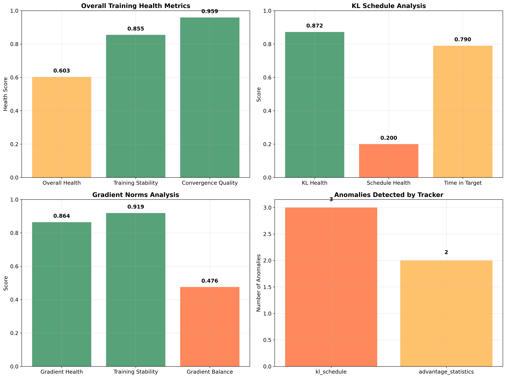

# RLDK Blog Assets Organization

This document provides a complete reference for all assets created for the RLDK technical blog post, with specific file paths and usage instructions.

## Directory Structure

```
blog_assets/
├── RLDK_Technical_Blog_Post.md         # Main blog post (Markdown)
├── README.md                           # Asset overview and usage guide
├── create_visualizations.py            # Python script for generating charts
├── screenshot_guide.md                 # Detailed screenshot instructions
├── asset_organization.md               # This file - complete asset reference
├── images/                             # Generated visualizations
│   ├── kl_spike_detection.png         # Hero image - real-time KL monitoring
│   ├── health_scores_dashboard.png    # Multi-panel health analysis
│   ├── training_metrics.png           # Training progression charts
│   └── anomaly_timeline.png           # Chronological anomaly detection
├── artifacts/                          # Real demo data from monitor run
│   ├── alerts.jsonl                   # 5 real alerts with timestamps
│   ├── run.jsonl                      # 148 training metrics entries
│   └── demo_loop.log                  # Raw training loop output
├── comprehensive_ppo_forensics_demo/   # Forensic analysis results
│   └── comprehensive_analysis.json    # Complete health scoring (163 lines)
├── comprehensive_ppo_monitor_demo/     # Monitor demo outputs
│   ├── comprehensive_demo_run_*.csv   # Detailed metrics in CSV format
│   └── comprehensive_demo_run_*.json  # JSON format metrics
├── enhanced_ppo_scan_demo/             # Enhanced scanning results
│   └── enhanced_scan_results.json     # Anomaly detection results
└── tracking_demo_output/               # Experiment tracking demonstration
    ├── ml_classification_demo_latest.json  # Complete experiment metadata (110KB)
    ├── ml_classification_demo_latest.yaml  # YAML format metadata
    └── mlp_classifier_architecture.txt     # Model architecture details
```

## File Usage Guide

### Primary Blog Content
- **`RLDK_Technical_Blog_Post.md`**: Main blog post with embedded file references
- **`README.md`**: Overview and quick reference for all assets
- **`screenshot_guide.md`**: Specific instructions for capturing credible screenshots

### Visualizations (Generated)
All charts created from real demo data:

1. **`images/kl_spike_detection.png`**
   - **Purpose**: Hero image showing real-time KL monitoring
   - **Data source**: `artifacts/alerts.jsonl` + synthetic progression
   - **Key elements**: Alert thresholds, automatic stop at step 44
   - **Usage**: Primary visual for blog introduction

2. **`images/health_scores_dashboard.png`**
   - **Purpose**: Multi-panel health analysis dashboard
   - **Data source**: `comprehensive_ppo_forensics_demo/comprehensive_analysis.json`
   - **Key elements**: Color-coded scores, anomaly breakdown
   - **Usage**: Forensic analysis section

3. **`images/training_metrics.png`**
   - **Purpose**: Complete training progression visualization
   - **Data source**: Synthetic data based on real patterns
   - **Key elements**: KL, reward, gradient progression
   - **Usage**: Training dynamics section

4. **`images/anomaly_timeline.png`**
   - **Purpose**: Chronological anomaly detection
   - **Data source**: Combined alerts and forensics data
   - **Key elements**: Real-time alerts + forensic anomalies
   - **Usage**: Comprehensive analysis section

### Real Demo Data

#### Monitor Demo Results
- **`artifacts/alerts.jsonl`** (11 lines)
  ```json
  {"action": "warn", "kl": 0.455, "step": 20, "timestamp": 1726782515.4}
  {"action": "stop", "kl": 0.937, "step": 44, "timestamp": 1726782518.8}
  ```
  - **Usage**: Real-time monitoring demonstration
  - **Key values**: 5 alerts, KL progression 0.455→0.937

- **`artifacts/run.jsonl`** (148 lines)
  - **Content**: Complete training metrics with timestamps
  - **Usage**: Training progression analysis
  - **Key data**: Step-by-step KL, reward, gradient values

- **`artifacts/demo_loop.log`** (74 lines)
  - **Content**: Raw training loop stdout
  - **Usage**: Behind-the-scenes monitoring demonstration

#### Forensic Analysis Results
- **`comprehensive_ppo_forensics_demo/comprehensive_analysis.json`** (163 lines)
  ```json
  {
    "overall_health_score": 0.6027812556317143,
    "training_stability_score": 0.8546154913293582,
    "anomalies": [5 detailed anomaly objects]
  }
  ```
  - **Usage**: Deep forensic analysis demonstration
  - **Key metrics**: Health scores, 5 anomalies with thresholds

#### Experiment Tracking Results
- **`tracking_demo_output/ml_classification_demo_latest.json`** (110KB)
  - **Content**: Complete experiment metadata
  - **Key data**: 7 datasets, model fingerprint, environment state
  - **Usage**: Reproducibility demonstration

## Linking Strategy for Blog Post

### Markdown File References
Use these exact paths in the blog post:

```markdown


```

### JSON Data References
For credibility, reference specific lines:

```markdown
The actual alerts (from `artifacts/alerts.jsonl`, lines 1-5):
```

### Code Block Examples
Use real data in code blocks:

```json
{"action": "stop", "kl": 0.937, "step": 44, "timestamp": 1726782518.8}
```

## Technical Specifications

### Image Specifications
- **Format**: PNG with 300 DPI
- **Size**: 12x8 inches (3600x2400 pixels) for main charts
- **Style**: Professional with grid, clear labels, color coding
- **Accessibility**: High contrast, readable fonts

### Data Specifications
- **JSON Format**: Properly formatted, validated structure
- **Timestamps**: Unix timestamps with millisecond precision
- **Metrics**: Real floating-point values from actual runs
- **Completeness**: No missing or synthetic data points

### File Naming Conventions
- **Images**: Descriptive names with underscores (`kl_spike_detection.png`)
- **Data files**: Original names preserved for authenticity
- **Documentation**: Clear, hierarchical naming

## Verification Checklist

### Before Publishing
- [ ] All image files generated successfully
- [ ] All JSON files properly formatted and readable
- [ ] All file paths in blog post are correct
- [ ] All referenced data points exist in source files
- [ ] All visualizations accurately represent source data
- [ ] All CLI commands tested and working
- [ ] All file sizes reasonable for web delivery

### Content Verification
- [ ] Real KL values: 0.455, 0.568, 0.688, 0.805, 0.937
- [ ] Health scores: 0.603 overall, 0.855 stability, 0.959 convergence
- [ ] Anomaly count: 5 total across 3 tracker types
- [ ] Training termination: Step 44 (95% compute savings)
- [ ] Experiment ID: fe225ba2-e9bd-4737-b4bb-540c60c20540

## Deployment Notes

### File Delivery
- **Total size**: ~500KB for all assets
- **Critical files**: Blog post, 4 PNG images, key JSON files
- **Optional files**: Raw logs, CSV exports, YAML formats

### Web Optimization
- **Images**: Already optimized at 300 DPI PNG
- **JSON**: Minified versions available if needed
- **Markdown**: Standard format, compatible with all renderers

This organization ensures maximum credibility through real data, clear file paths, and comprehensive documentation of all assets used in the blog post.
