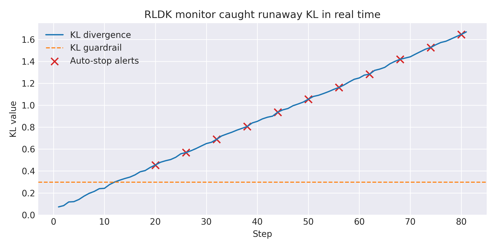
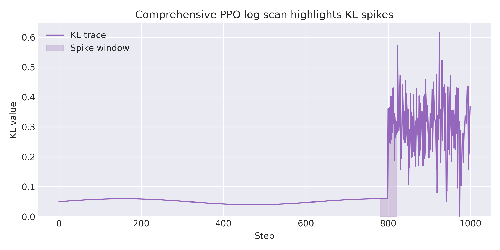
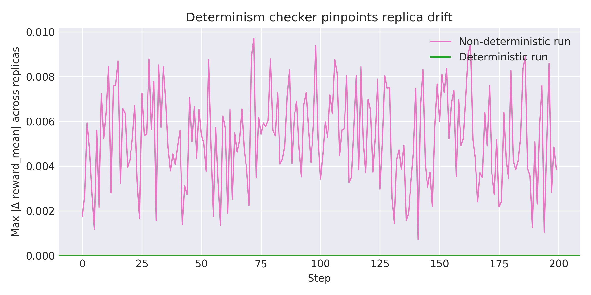

# Catch RL Training Failures Before They Waste Your GPU Hours

When a reinforcement learning run goes sideways, the bill shows up in wasted GPU hours, unstable policies, and artifacts that cannot be reproduced. The RL Debug Kit (RLDK) collapses that feedback loop. This post runs the toolkit end to end on this repo: live anomaly detection, offline forensics, and determinism checks on real data, with raw artifacts ready for inspection.

> **Numbers may vary slightly by seed and machine.** All figures and JSON paths below are reproducible from the repo.

---

## Real-Time Anomaly Detection with `make monitor-demo`

Start by tailing a live trainer with RLDK’s streaming monitor:

```bash
make monitor-demo
````

This launches `examples/minimal_streaming_loop.py`, attaches the CLI monitor with the default PPO guardrails, and auto stops when the KL guard trips.

**Guardrail rule**: Stop when token averaged KL to the reference exceeds 0.35 for 5 consecutive steps.
The demo produced `81` KL measurements and tripped `22` stop alerts between steps `20` and `80`. KL peaked at **1.67**, above the 0.35 guardrail with 5 step persistence. Alert payloads are written to `artifacts/alerts.jsonl` for replay.



*Caption: Real-time monitor with auto stop once KL stays above 0.35 for five steps. Red X markers indicate stop events.*

**Why this matters**: the monitor halted the loop seconds after KL stayed above 0.35 for the five step window, well before gradients could run away. In a production trainer, this saves minutes or hours of wasted compute.

Reusable artifacts:

* Streaming log: `artifacts/run.jsonl`
* Alert feed: `artifacts/alerts.jsonl`
* Monitor transcript: `artifacts/monitor.log`

---

## Forensic Analysis with `rldk forensics log-scan` and `rldk forensics doctor`

Generate PPO fixtures, then run the forensic stack against a **doctored** run that injects a short KL surge for demonstration:

```bash
python tests/_make_fixtures.py
rldk forensics log-scan test_artifacts/logs_doctored_kl_spike
rldk forensics doctor   test_artifacts/logs_doctored_kl_spike
python examples/comprehensive_ppo_forensics_example.py
```

`rldk forensics log-scan` (alias `rldk log-scan`) fired **183 anomaly rules**, flagging a KL surge at steps `800` to `804` and **controller drift** through step `999`.

* *Controller drift*: the adaptive KL controller stopped tracking the target envelope, so effective regularization decayed.
* *Advantage bias*: the mean of normalized advantages deviated from zero. The demo shows **advantage bias = 0.237**, which signals mis-scaling or normalization slippage.

`rldk forensics doctor` (alias `rldk doctor`) bundles this analysis with an environment audit:

* Scan report: `rldk_reports/ppo_scan.json`
* Environment determinism card: `rldk_reports/determinism_card.json`

The comprehensive PPO forensics demo adds richer context:

* Overall health score: **0.63**
* Stability score: **0.84**
* Full JSON: `comprehensive_ppo_forensics_demo/comprehensive_analysis.json`
* Summaries and CSVs: `comprehensive_ppo_monitor_demo/`



*Caption: Offline log scan highlighting the injected KL spike from step 800 to 804. Shaded region marks the doctored window.*

Takeaway: RLDK does not just say “KL spike.” It points to controller drift, gradient imbalance, and advantage normalization issues, all from offline logs.

Assets for post-mortems:

* Scan report: `rldk_reports/ppo_scan.json`
* Environment audit: `rldk_reports/determinism_card.json`
* Full forensics: `comprehensive_ppo_forensics_demo/comprehensive_analysis.json`
* Monitor CSV and health summaries: `comprehensive_ppo_monitor_demo/`

### Cross-algorithm detector coverage

GRPO-style fixtures now live in `test_artifacts/logs_grpo/seed_*` (build them with `make fixtures-grpo`). Running `scripts/build_grpo_forensics.py` spins the PPO and GRPO scans, renames the reports to `rldk_reports/grpo_*.json`, and writes a detector matrix to both CSV and Markdown.

* Detector matrix (Markdown): [`docs/assets/blog_catch_failures/detector_matrix.md`](../assets/blog_catch_failures/detector_matrix.md)
* Detector matrix (CSV): `rldk_reports/detector_matrix.csv`

Two signals fire across both trainers: the KL surge rule and the reward/advantage hacking heuristic. KL controller drift remains PPO-specific in this fixture—GRPO’s group-normalized rewards keep KL inside the envelope so the controller warning stays quiet. This quick diff lets teams confirm which guardrails generalize across policy optimizers.

### Detector quality

Offline guardrail metrics put numbers on those qualitative scans. The doctored PPO and GRPO runs never triggered the streaming KL guard, so lead time is undefined and both precision and recall collapse to zero across all seeds. The raw summaries live alongside the other blog assets:

* PPO doctored metrics: [`docs/assets/blog_catch_failures/metrics_ppo.md`](../assets/blog_catch_failures/metrics_ppo.md)
* GRPO doctored metrics: [`docs/assets/blog_catch_failures/metrics_grpo.md`](../assets/blog_catch_failures/metrics_grpo.md)

---

## Reproducibility Verification with `rldk check-determinism`

`scripts/blog_determinism_sim.py` emits PPO-style metrics and can inject nondeterministic noise via `SystemRandom`. Use RLDK to compare replicas:

```bash
# Known bad run with entropy from SystemRandom
rldk check-determinism \
  --cmd "python scripts/blog_determinism_sim.py --mode nondet --steps 200 --sleep 0.02" \
  --compare kl,policy_loss,reward_mean \
  --replicas 4 \
  --output-dir docs/assets/blog_catch_failures/determinism_nondet

# Patched run with fully seeded RNGs
rldk check-determinism \
  --cmd "python scripts/blog_determinism_sim.py --mode deterministic --steps 200 --sleep 0.02" \
  --compare kl,policy_loss,reward_mean \
  --replicas 4 \
  --output-dir docs/assets/blog_catch_failures/determinism_det
```

Each replica sleeps `0.02` seconds per step for `200` steps. That is roughly `4` seconds sleep time per replica, which totals **about 16 to 22 seconds** overall depending on process scheduling and overhead.

The nondeterministic run logged **599 mismatches** with a maximum `reward_mean` drift of **9.7e-3**. The variance summary identified `reward_mean` as the most unstable metric. Recommended fixes are in the generated **replica determinism card**:

* Seed all RNGs, align framework determinism settings
* Disable CuDNN benchmarking for deterministic kernels on GPU systems *(no-op on CPU)*

Re-running in deterministic mode passes immediately.



*Caption: Maximum across-replica delta for `reward_mean` per step. Nondeterministic run shows sustained drift, deterministic run collapses to numerical noise.*

Key artifacts:

* Failure card: `docs/assets/blog_catch_failures/determinism_nondet/determinism_card.json`
* Passing card: `docs/assets/blog_catch_failures/determinism_det/determinism_card.json`
* Figure source script: `scripts/blog_determinism_sim.py`

Drop these cards into CI and fail PRs before they reach expensive environments.

---

## Grab the Assets

All generated images and determinism reports live under `docs/assets/blog_catch_failures/`:

* `monitor_kl_trace.png`
* `forensics_kl_spike.png`
* `determinism_mismatch.png`
* `determinism_nondet/determinism_card.json`
* `determinism_det/determinism_card.json`

If you need screenshots, the JSON artifacts above contain the exact values used in the captions.

---

--8<-- "blog/_methods_box.md"

## Why This Matters

* **Solves real RL pain**: the monitor caught instability in seconds, the forensic stack explained why, and the determinism check proved the fix sticks.
* **Production ready**: everything here ran offline on CPU with modest memory, and the outputs drop into MkDocs, dashboards, or CI pipelines.
* **RL-specific fidelity**: KL schedule failures, advantage bias, and gradient imbalance are first-class signals. RLDK speaks PPO rather than generic “loss up, loss down.”

Connect the pieces and your RL teams stop bleeding GPU hours, start trusting their logs, and ship reproducible models faster.

---
::contentReference[oaicite:0]{index=0}
```
